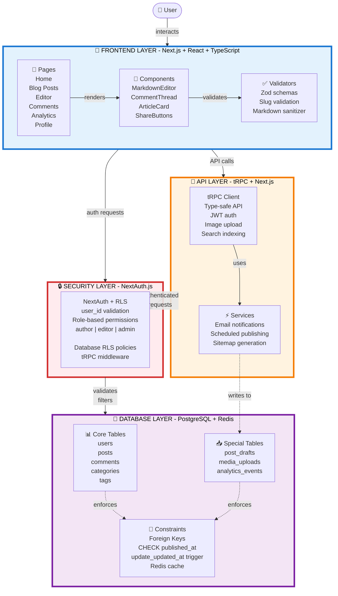

# Architecture Diagram Prompt - Complete Example

This is a complete example showing how to use the prompt template for a **Blog Publishing Platform**.

---

## Filled Prompt

```
Create a high-level system architecture diagram in Mermaid format (graph TB) with this 3-tier layout:

TOP LAYER (User + Frontend):
- Technology: Next.js + React + TypeScript
- Pages: Home, Blog Posts, Editor, Comments, Analytics, Profile
- Components: MarkdownEditor, CommentThread, ArticleCard, ShareButtons
- Validators: Zod schemas, slug validation, markdown sanitization

MIDDLE LAYER (Side-by-side):

API LAYER:
- Technology: tRPC + Next.js API Routes
- Main features: Type-safe API, JWT auth, image upload, search indexing
- Services: Email notifications, scheduled publishing, sitemap generation

SECURITY LAYER:
- Technology: NextAuth.js + PostgreSQL RLS
- Main policy: user_id validation + role-based permissions (author/editor/admin)
- Enforcement: Database RLS policies + tRPC middleware

BOTTOM LAYER (Database):
- Technology: PostgreSQL + Redis (cache)
- Core tables: users, posts, comments, categories, tags
- Special tables: post_drafts, media_uploads, analytics_events
- Constraints: Foreign keys, CHECK (published_at <= created_at), triggers (update_updated_at)

REQUIREMENTS:
- Use 3-tier vertical stack (Top: Frontend, Middle: API + Security side-by-side, Bottom: Database)
- Color-coded subgraphs with 4px borders
- Emoji icons for each layer (🎨 Frontend, 🔌 API, 🔒 Security, 💾 Database)
- Colors: Frontend=blue, API=orange, Security=red, Database=purple
- All labels must be readable with no overlap
- Use line breaks (<br/>) for long text
- Solid arrows (-->) for main flow, dashed (-.->)  for internal connections
- Include connection labels (e.g., |validates|, |enforces|)
```

---

## Expected Output (Mermaid Code)



---

## How This Translates

| Your System Info | Where It Appears in Diagram |
|------------------|------------------------------|
| Next.js + React + TypeScript | Frontend subgraph title |
| Pages: Home, Blog Posts... | "Pages" node content |
| Components: MarkdownEditor... | "Components" node content |
| Validators: Zod schemas... | "Validators" node content |
| tRPC + Next.js API Routes | API subgraph title |
| Type-safe API, JWT auth... | "Client" node content |
| Email notifications... | "Services" node content |
| NextAuth.js + PostgreSQL RLS | Security subgraph title |
| user_id validation + roles | "Auth" node content |
| PostgreSQL + Redis | Database subgraph title |
| users, posts, comments... | "Core Tables" node content |
| post_drafts, media_uploads... | "Special Tables" node content |
| Foreign Keys, CHECK... | "Constraints" node content |

---

## Customization Points

You can adjust:

1. **Node icons**: Change 📄 📊 📥 🔗 ⚡ to match your domain (e.g., 📰 for news, 🛒 for e-commerce)

2. **Layer titles**: Shorten if needed (e.g., "Next.js + React" → "Next.js")

3. **Node grouping**: Combine related items (e.g., merge Components + Validators if too crowded)

4. **Connection labels**: Use domain-specific verbs (e.g., "publishes", "moderates", "tracks")

5. **Colors**: Use the alternative color schemes from the main template

---

## Quick Adaptation Checklist

To adapt this for your system:

- [ ] Replace "Next.js" with your frontend framework
- [ ] Replace "tRPC" with your API technology
- [ ] Replace "NextAuth.js" with your auth solution
- [ ] Replace "PostgreSQL" with your database
- [ ] List your actual pages (4-6 main routes)
- [ ] List your key components (3-5)
- [ ] List your validation approach
- [ ] List your API features (3-4)
- [ ] List your background services (2-3)
- [ ] Describe your security policy
- [ ] List your core database entities (4-6)
- [ ] List your special/auxiliary tables (2-3)
- [ ] List your database constraints/rules

---

## Result Preview

When rendered, this produces a clean diagram showing:

```
        👤 User
           ↓
    ┌──────────────────┐
    │  FRONTEND        │  (Blue box)
    │  Pages → Comp    │
    └──────────────────┘
         ↓       ↓
    ┌────────┐ ┌──────┐
    │  API   │ │ AUTH │  (Orange + Red boxes, side-by-side)
    └────────┘ └──────┘
         ↓       ↓
    ┌──────────────────┐
    │  DATABASE        │  (Purple box)
    │  Tables → Rules  │
    └──────────────────┘
```

All labels readable, proper spacing, clear hierarchy!
