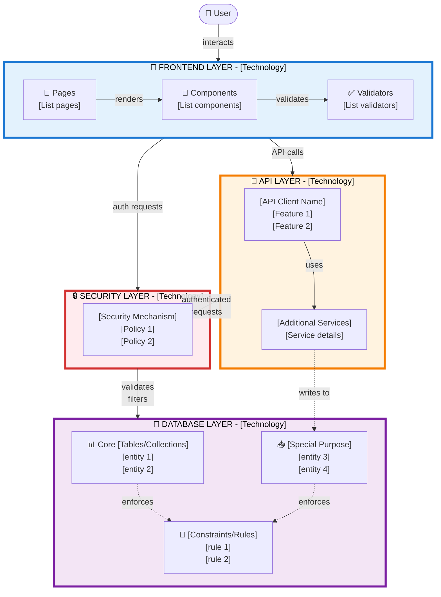

# High-Level System Architecture Diagram - Prompt Template

Use this prompt template to generate clean, readable system architecture diagrams following a 3-tier layout pattern.

---

## Prompt to Use

```
Create a high-level system architecture diagram in Mermaid format with the following specifications:

## LAYOUT REQUIREMENTS

### 3-Tier Structure (Top to Bottom):
1. **TOP LAYER**: User + Frontend Layer
2. **MIDDLE LAYER**: API Layer and Security Layer (side-by-side)
3. **BOTTOM LAYER**: Database/Storage Layer

### Visual Requirements:
- All boxes must be clearly stacked from top to bottom
- Middle layer components must be positioned side-by-side
- All connection labels must be readable (no overlapping with box edges)
- Use line breaks in labels when text is long
- Use emojis for visual clarity
- Color-coded layers with thick borders (4px)

## SYSTEM INFORMATION

Fill in these details about your system:

### Frontend Layer
- **Technology**: [e.g., React, Vue, Angular, Next.js]
- **Main Pages/Routes**: [list 4-6 key pages]
- **Key Components**: [e.g., Modals, Forms, Tables, Charts]
- **Validation/Utilities**: [e.g., Zod schemas, form validators, formatters]
- **Special Features**: [e.g., Brazilian formatters, i18n, theme system]

### API Layer
- **Technology**: [e.g., REST API, GraphQL, gRPC, Supabase SDK]
- **Key Features**: [e.g., Type-safe client, JWT auth, auto-generated types]
- **Additional Services**: [e.g., Edge functions, webhooks, background jobs]

### Security Layer
- **Technology**: [e.g., Row Level Security (RLS), API Gateway, OAuth, JWT]
- **Key Policies**: [e.g., user_id validation, role-based access, tenant isolation]
- **Enforcement Points**: [e.g., database level, middleware, API gateway]

### Database/Storage Layer
- **Technology**: [e.g., PostgreSQL, MongoDB, DynamoDB]
- **Core Tables/Collections**: [list main entities]
- **Specialized Tables**: [e.g., import staging, audit logs, cache]
- **Constraints/Rules**: [e.g., foreign keys, CHECK constraints, triggers, indexes]

### Connection Flow
- How does Frontend connect to API? [e.g., direct SDK calls, HTTP requests]
- How does Frontend connect to Security? [e.g., through API, separate auth service]
- How does API connect to Database? [e.g., through RLS policies, ORM]
- Any async/background processing? [e.g., message queues, event streams]

## OUTPUT FORMAT

Generate a Mermaid diagram with:
- `graph TB` (top to bottom orientation)
- 4 color-coded subgraphs with emoji icons:
  - 🎨 Frontend (blue: #e3f2fd / #1976d2)
  - 🔌 API (orange: #fff3e0 / #f57c00)
  - 🔒 Security (red: #ffebee / #d32f2f)
  - 💾 Database (purple: #f3e5f5 / #7b1fa2)
- Clear node labels with line breaks for readability
- Solid arrows (-->) for main flow
- Dashed arrows (-.->)  for secondary/internal connections
- Labels on connections using |label text|

## EXAMPLE STRUCTURE


```

---

## QUICK FILL TEMPLATE

Copy and customize this for your system:

```
System Name: [Your system name]

FRONTEND LAYER
- Technology: [React/Vue/Angular/etc]
- Pages: [page1, page2, page3, page4]
- Components: [component1, component2, component3]
- Validators: [validation libraries/utilities]

API LAYER
- Technology: [REST/GraphQL/Supabase/etc]
- Client Features: [feature1, feature2, feature3]
- Additional Services: [service1, service2]

SECURITY LAYER
- Technology: [RLS/JWT/OAuth/etc]
- Main Policy: [e.g., auth.uid() = user_id]
- Enforcement: [where security is enforced]

DATABASE LAYER
- Technology: [PostgreSQL/MongoDB/etc]
- Core Tables: [table1, table2, table3, table4]
- Special Tables: [staging, logs, cache]
- Constraints: [FK, CHECK, triggers]
```

---

## USAGE EXAMPLES

### Example 1: E-commerce Platform

```
FRONTEND: React + TypeScript
- Pages: Home, Products, Cart, Checkout, Orders, Account
- Components: ProductCard, CartModal, PaymentForm
- Validators: Zod schemas, credit card validation

API: REST API + Stripe SDK
- Client Features: Type-safe API client, JWT auth, auto-retry
- Services: Payment processing, email notifications

SECURITY: JWT + API Gateway
- Main Policy: Role-based access (customer/admin)
- Enforcement: API Gateway + middleware

DATABASE: PostgreSQL
- Core Tables: users, products, orders, payments
- Special Tables: cart_sessions, audit_log
- Constraints: Foreign keys, CHECK (price > 0), triggers
```

### Example 2: SaaS Analytics Platform

```
FRONTEND: Next.js + React Query
- Pages: Dashboard, Reports, Settings, Integrations, Billing
- Components: Charts, DataGrid, FilterPanel
- Validators: Query builders, date range validators

API: GraphQL + Background Workers
- Client Features: Apollo Client, subscriptions, caching
- Services: Data aggregation, export jobs, webhooks

SECURITY: Multi-tenant RLS + OAuth
- Main Policy: tenant_id isolation + user permissions
- Enforcement: Database RLS + GraphQL resolvers

DATABASE: PostgreSQL + TimescaleDB
- Core Tables: tenants, users, metrics, events
- Special Tables: time_series_data, aggregations
- Constraints: Partitioning, hypertables, materialized views
```

---

## TIPS FOR BEST RESULTS

1. **Keep labels concise**: Use abbreviations if needed (e.g., "auth.uid() = user_id" instead of full explanation)

2. **Use line breaks strategically**: Break long lists into multiple lines (use `<br/>` in Mermaid)

3. **Limit nodes per layer**: 3-4 boxes per layer maximum for readability

4. **Be specific about connections**: Label arrows with action verbs (e.g., "validates", "enforces", "invokes")

5. **Group related items**: Use bullet points within nodes to show related features

6. **Test the diagram**: Always render in Mermaid Live Editor (https://mermaid.live/) to check for overlap

---

## CHECKLIST

Before finalizing your diagram, verify:

- [ ] All layers are clearly stacked (top to bottom)
- [ ] API and Security are side-by-side in middle layer
- [ ] No labels overlap with box borders
- [ ] All text is readable (not too small or cramped)
- [ ] Colors are applied correctly to each layer
- [ ] Arrows flow logically (User → Frontend → API/Security → Database)
- [ ] Internal connections use dashed lines
- [ ] All major components are represented
- [ ] Diagram renders without syntax errors

---

## RENDERING OPTIONS

### Option 1: HTML File
Save as `.html` and use Mermaid CDN:

```html
<!DOCTYPE html>
<html>
<head>
    <script type="module">
        import mermaid from 'https://cdn.jsdelivr.net/npm/mermaid@10/dist/mermaid.esm.min.mjs';
        mermaid.initialize({ startOnLoad: true });
    </script>
</head>
<body>
    <div class="mermaid">
        [Your Mermaid code here]
    </div>
</body>
</html>
```

### Option 2: Markdown File
Save as `.mermaid` or embed in markdown:

````markdown
```mermaid
[Your Mermaid code here]
```
````

### Option 3: Online Viewer
Paste into https://mermaid.live/

### Option 4: VS Code
Install "Markdown Preview Mermaid Support" extension

---

## CUSTOMIZATION

### Color Schemes

**Default (Current)**:
- Frontend: Blue (#e3f2fd / #1976d2)
- API: Orange (#fff3e0 / #f57c00)
- Security: Red (#ffebee / #d32f2f)
- Database: Purple (#f3e5f5 / #7b1fa2)

**Alternative - Dark Theme**:
- Frontend: Dark Blue (#1a237e / #ffffff)
- API: Dark Orange (#e65100 / #ffffff)
- Security: Dark Red (#b71c1c / #ffffff)
- Database: Dark Purple (#4a148c / #ffffff)

**Alternative - Monochrome**:
- Frontend: Light Gray (#f5f5f5 / #212121)
- API: Medium Gray (#e0e0e0 / #424242)
- Security: Gray (#bdbdbd / #616161)
- Database: Dark Gray (#9e9e9e / #757575)

---

## LICENSE

This template is based on the architecture diagram pattern developed for the Brazilian Personal Finance Control System (prompt-finplan-buddy).

Feel free to adapt and use for any project.

**Created**: 2025-11-09
**Version**: 1.0
